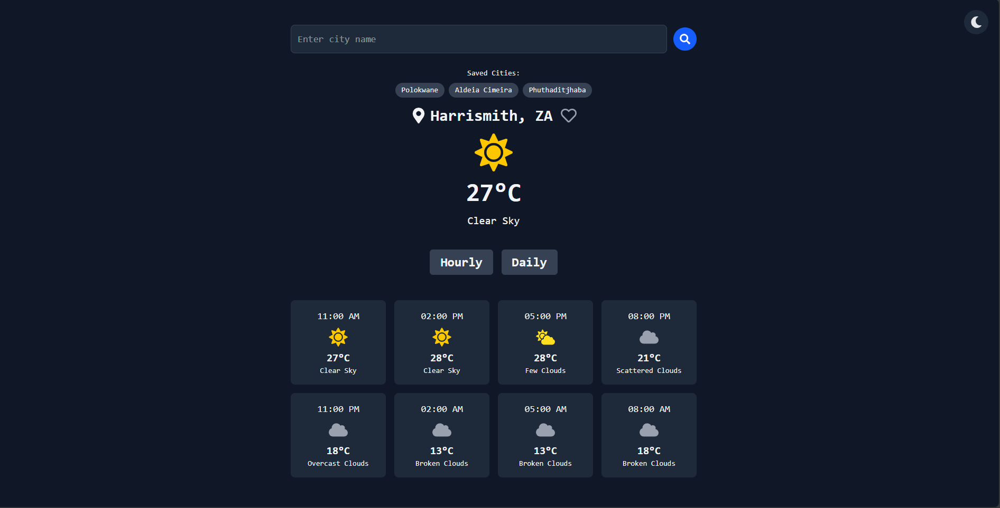

# Weather App

A weather app built with React + Typescript and powered by open weather app.It supports dark/light mode ,offline catching and saved locations for quick access.

## Screenshot 

Here is the preview of the Weather App

# Features

- Real-time weather updates(temperature,humidity,wind speed)
- Dark and light mode toggle
- Hourly and Daily forecast view
- Offline caching for previously fetched data
- Save and revisit favorite locations
- Mobile responsive design

## Tech Stack

- React + Typescript
- Tailwind CSS
- OpenWeatherMap API
- React Icons

## Installation

**Clone repository**

[git clone https://github.com/yourusername/weather-app.git](https://github.com/Refilwe15/weather-app-react-task4-codetribe.git)

**navigate into the project**

cd weather-app-react-task4-codetribe

**Install dependencies**

npm install

**start the app**

npm run dev

